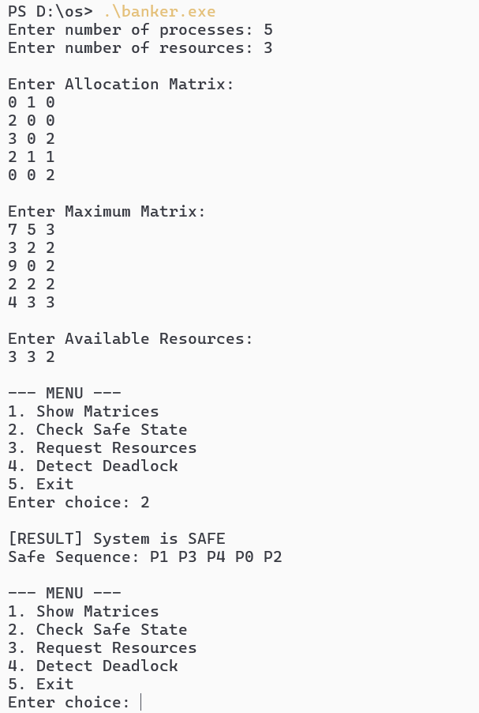
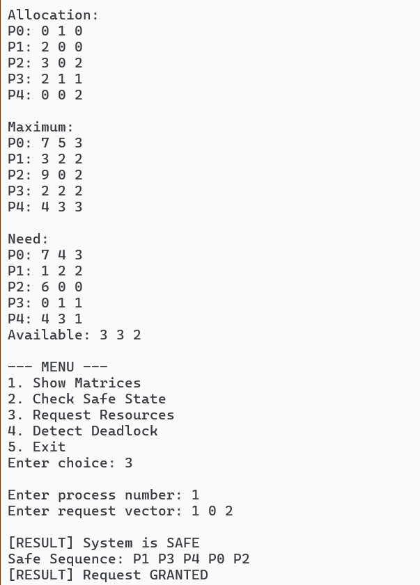
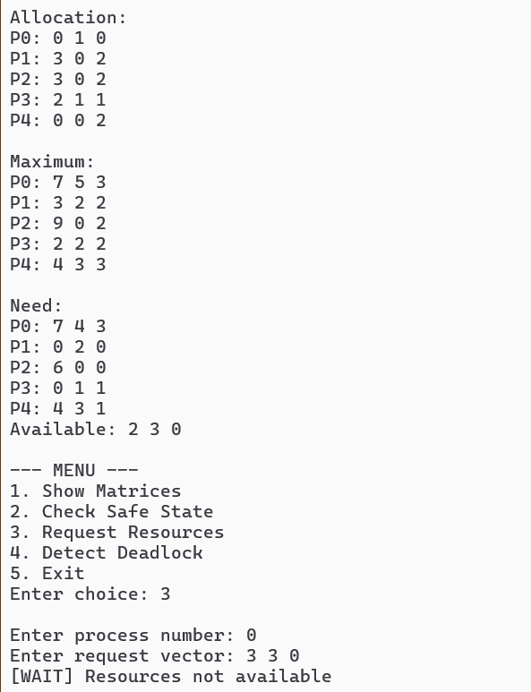
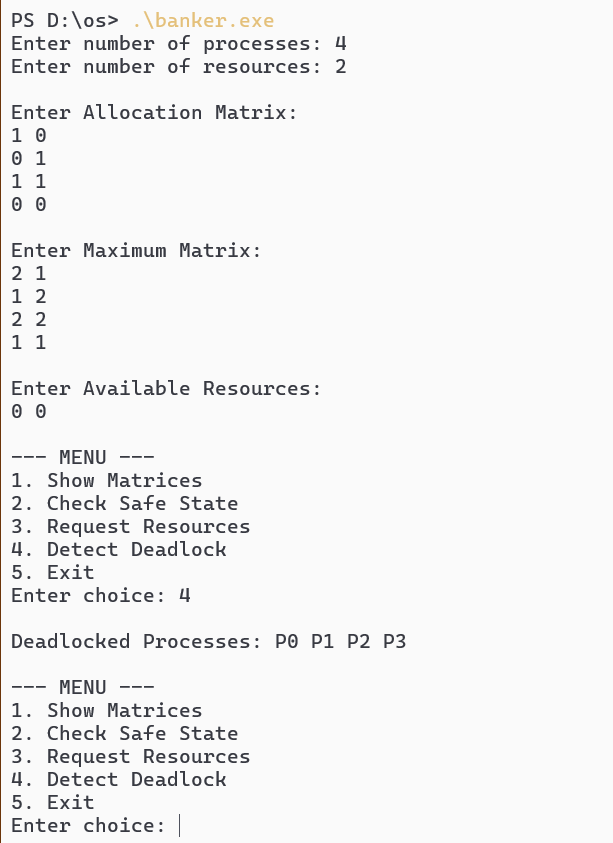

# Deadlock Avoidance and Detection Simulator using  Banker’s Algorithm

# Banker's Algorithm in C

This project implements the Banker's Algorithm in C to manage resource allocation and avoid deadlock in an operating system.

The program allows you to:

* View Allocation, Maximum, Need, and Available matrices
* Check if the system is in a safe state
* Request resources dynamically
* Detect deadlock in the system

## Features

* Safety Algorithm (checks safe sequence)
* Resource Request Algorithm (with rollback if unsafe)
* Deadlock Detection
* Input validation (Allocation cannot exceed Maximum)
* Menu-driven program for easy use

## Requirements

* C compiler (GCC recommended)
* Windows / Linux / Mac terminal

## How to Compile

Open terminal in the project folder and run:

```bash
gcc bankers.c -o banker
```

## How to Run

### On Linux / Mac:

```bash
./banker
```

### On Windows:

```bash
banker.exe
```

## How to Use

1. Enter number of processes and resources
2. Input Allocation Matrix
3. Input Maximum Matrix
4. Input Available Resources

Then use the menu:

```
1. Show Matrices
2. Check Safe State
3. Request Resources
4. Detect Deadlock
5. Exit
```

## Example Operations

### Check Safe State

* Displays whether system is SAFE or UNSAFE
* Shows safe sequence if exists

### Request Resources

* Enter process number and request vector
* If request is valid and safe → granted
* If not available → wait
* If unsafe → request denied and rolled back

### Detect Deadlock

* Shows all deadlocked processes
* If none → prints "None"

## Examples

### Safe State
The system is safe and produces a valid sequence.



### Resource Request (Granted)
Valid request that maintains system safety.



### Resource Request (Denied)
Request exceeds available resources.



### Deadlock Detection
Processes involved in deadlock are listed.



## Important Notes

* Request must be less than or equal to Need
* Request must be less than or equal to Available
* System only grants request if it remains in a safe state

## Limitations

* Maximum number of processes and resources is 10
* Input is manual (no file input support)

## Author

Created as part of Operating Systems  coursework.
